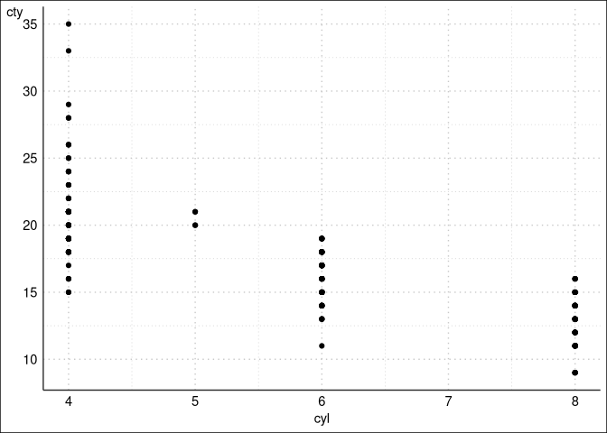

<!-- README.md is generated from README.Rmd. Please edit that file -->

# ggcapdthemes

<!-- badges: start -->
<!-- badges: end -->

The goal of ggcapdthemes is to …

## Installation

You can install the development version of ggcapdthemes from
[GitHub](https://github.com/) with:

``` r
# install.packages("devtools")
devtools::install_github("usepa/ggcapdthemes")
```

## Example

This is a basic example which shows you how to solve a common problem:

``` r
library(ggcapdthemes)
## basic example code
df <- ggplot2::mpg
ggplot2::ggplot(df, ggplot2::aes(x=cyl, y=cty)) +
   ggplot2::geom_point() +
   theme_egrid()
```


