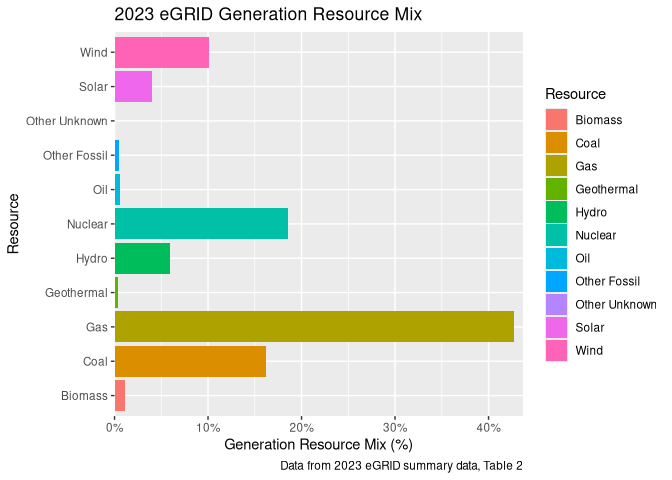

<!-- README.md is generated from README.Rmd. Please edit that file -->

# ggcapdthemes

<!-- badges: start -->
<!-- badges: end -->

The goal of ggcapdthemes is to …

## Installation

You can install the development version of ggcapdthemes from
[GitHub](https://github.com/) with:

``` r
# install.packages("devtools")
devtools::install_github("usepa/ggcapdthemes")
```

## Example

This is a basic example which shows you how to solve a common problem:

``` r
library(ggplot2)
library(ggcapdthemes)
## basic example code
df <- mpg
ggplot(df, aes(x=cyl, y=cty)) +
   geom_point() +
   theme_egrid()
```



## Disclaimer

The United States Environmental Protection Agency (EPA) GitHub project
code is provided on an “as is” basis and the user assumes responsibility
for its use. EPA has relinquished control of the information and no
longer has responsibility to protect the integrity , confidentiality, or
availability of the information. Any reference to specific commercial
products, processes, or services by service mark, trademark,
manufacturer, or otherwise, does not constitute or imply their
endorsement, recommendation or favoring by EPA. The EPA seal and logo
shall not be used in any manner to imply endorsement of any commercial
product or activity by EPA or the United States Government.
