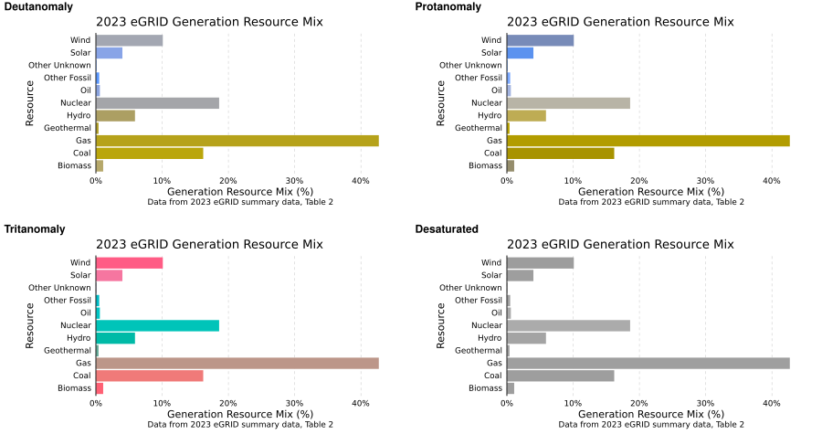

```{r, include = FALSE}
knitr::opts_chunk$set(
  collapse = TRUE,
  comment = "#>",fig.width=8, fig.height=4, dev='svg'
)
```

```{r setup, }
library(ggplot2)
library(ggcapdthemes)
```

```{css, echo=F}
.inline-figure {
  border: none !important;
}

```

## Color as highlight

This theme includes both quantitative and categorical color palettes. However, there are some situations where you might
not want to use a whole palette; instead, you might want to use color to draw attention only to specific parts of a chart
without overwhelming the user. For more details on using color as a highlight, see the of the Data
Visualization Style Guide.

### Highlighting discrete colors

Using the `gghighlight` package to assist, we can emphasize certain groups or elements of charts.
Leave fuel type as original color, gray out non-highlighted groups.

```{r}
p_bar <- gg_ex_bar +
  scale_color_capd_discrete(palette = 'fuel_type') +
  theme_capd(plot_direction = 'vert', legend_position = 'none')
```

```{r}
p_bar + gghighlight::gghighlight(
  resource == 'gas',
  unhighlighted_params = list(
    fill = '#C9C9C9', 
    color = '#2E2E2E',
    linewidth = 0.2) 
)
  
```

### Highlighting continuous colors

```{r, eval=F}
p_co2 <- ggplot(co2_emission_2022, aes(y = Region, x = co2)) + 
  geom_bar(stat = 'identity', fill = '#2378C3') + 
  theme_capd()

p_co2 +
  gghighlight::gghighlight(
    Region == 'NYUP',
    unhighlighted_params = list(
      fill = '#C9C9C9', 
      linewidth = 0.2
    ) 
  )

```

<a href="#TOC">Return to Table of Contents</a>

## Legends

Legends are most helpful and accessible when they are directly attached to the relevant data elements. If that isn’t
possible, keeping them as close as possible to the data elements is a good compromise. For more details on legend design,
see the of the Data Visualization dedicated section Style Guide.

By default, ggplot sorts character variables for color / fill alphabetically from A to Z. Sometimes this is desired, other times there are more useful orders for aligning to the data at hand.

```{r, echo = T}
ggplot(data = so2_aq,
       aes(x=year, y=value, color=stat)) +
  geom_line() +
  labs(color = 'Statistic') + 
  theme_capd()
```

### Sorting legend entries

Using the `fct_reorder2` function from the `forcats` tidyverse package, you can easily reorder columns by another columns value. This allows the legend categories to go in order of highest to lowest value.

```{r}
ggplot(so2_aq,
       aes(x=year, y=value, color = forcats::fct_reorder2(stat, year, value))) +
  geom_line() +
  labs(color = 'Statistic') + 
  theme_capd()

```

### Adding direct labels on your chart

Through the help of the `directlabels` package, you can also add labels directly onto a ggplot for easier context. Here we add them to the end of the lines using the `method = 'last.qp'` argument.

```{r}
p_direct <- ggplot(so2_aq, aes(x=year, y=value, color=stat)) +
              geom_line() +
              labs(color='Statistic', y = 'SO_2 Air Quality') + 
              theme_capd()

directlabels::direct.label(p_direct, method = 'last.qp')
directlabels::direct.label(p_direct, method = 'first.qp')

```

<a href="#TOC">Return to Table of Contents</a>

## Tooltips

Tooltips that call out names, values, and style (color, stroke pattern, etc.) of individual data elements can help make those
data points easier to identify in your chart. For more details on tooltip design, see the of the Data
Visualization Style Guide.

### Plotly

The `plotly` package can be used for interactive charts. To turn a ggplot object into a plotly chart, wrap it in `plotly::ggplotly()`.

```{r,eval=F}
p_so2 <-ggplot(so2_aq,
       aes(x=year, y=value, color = stat)) +
  geom_line() +
  labs(color = 'Statistic') + 
  scale_color_capd_discrete(palette = 'sequential') +
  theme_capd()

plotly::ggplotly(p_so2)
```

<a href="#TOC">Return to Table of Contents</a>

## Data labels

Like tooltips, data labels can help make individual or important data points easier to identify

<a href="#TOC">Return to Table of Contents</a>

## Alt text for charts 

Alternative text helps make charts more accessible for users who cannot rely on visuals. Alt text should be specific and
detailed but not overly wordy; it can be used in combination with other, non-visual representations of the same data, such as tables or direct downloads.

### Including Alt text manually

```{r, fig.alt='My alt text here'}
p_alt <- p_bar +
  labs(alt = 'My alt text here')

p_alt
```

### Generating alt text template

```{r,}
ggalttext::generate_alt_text(p_bar)
```
<a href="#TOC">Return to Table of Contents</a>


## Color accessibility

Variations of color accessibility can be assessed using the `colorblindr` package.

```{r, warning=F, eval=F, echo=T}
colorblindr::cvd_grid(p_bar)
```

```{r, eval=T, echo=F,fig.width=10, fig.height=10}


```

<a href="#TOC">Return to Table of Contents</a>

## Other Data Accessibility

Another way to make your charts more accessible is to provide the underlying data directly to users either by providing data
tables near their respective charts, or by allowing users to download that data.
