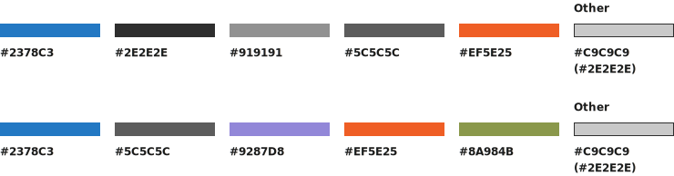

```{r, include = FALSE}
knitr::opts_chunk$set(
  fig.width = 8, fig.height=4, dev='svg'
)
```

## Introduction

Welcome! This vignette will demonstrate how the EPA CAPD Data Visualization Style Guide can be integrated into your R visualizations. Through the use of the `{ggcapdthemes}` package and the `theme_capd` function, you can easily customize and standardize your ggplots!

```{r, echo = FALSE}
knitr::include_graphics('chart-layout.svg')
```

## ggplot2 default settings

Because this package heavily depends on ggplot2, we suggest loading it prior to loading `ggcapdthemes`.

```{r}
library(ggplot2)
library(ggcapdthemes)
```

Using this data, we can see the default theme elements used by ggplot2.

```{r,echo=-1, eval=-2}
line_data <- read.csv('../inst/line_chart_example_data.csv',sep = ',', header=TRUE)
line_data <- read.csv('line_chart_example_data.csv',sep = ',', header=TRUE)
line_data$year <- round(line_data$year)
p_line <- ggplot(line_data) + geom_line(aes(x = year, y = value, color = group)) + 
  scale_y_continuous(limits=c(0,50), labels = scales::label_percent(scale = 1),expand = c(0,0)) +
  scale_x_continuous(limits=c(2002,2022), breaks=c(2002,2005,2010,2015,2020,2022), expand = c(0,0)) +
  labs(x = '',
       y = 'Resource Mix (%)', 
       title = "ABCD's Use of Non-Combustible Fuels remains above U.S. Average",
       subtitle = 'Percent of resource mix coming from non-combustible fuels, ABCD vs U.S. average, 2002-2022', 
       color = 'Legend')
p_line
```

Over the course of this vignette, we will sequentially edit components of the theme to show the incremental impact of the settings. Like other ggplot extension themes, `theme_capd` is build from one of the ggplot2 base themes, `theme_bw`, and extends it.

```{r, echo=3:4}
#line_data <- read.csv('../inst/line_chart_example_data.csv',sep = ',', header=TRUE)
#line_data$year <- round(line_data$year)
p_line +
  theme_bw()
```

<a href="#TOC">Return to Table of Contents</a>

## Font and font size

The "Source Sans 3" font is downloaded from Google Fonts and applied to all when `theme_capd` is used. An initial font size is specified using the `base_size` argument; this defaults to 11pt, but we will use 10pt for this example. 

Other fonts throughout the chart are re-sized relative to the `base_size`, using the `ggplot2::rel` function. The `half_line` setting is used for margins

```{r, eval=FALSE}
## Set and download font for theme
base_family <- 'Source Sans 3'
if(!(base_family %in% sysfonts::font_families())){
  sysfonts::font_add_google(base_family)
}

base_size <- 10
```

Here we see the font applied to all text elements by default; they will be re-sized in the sections below.

```{r, echo=F}
base_family <- 'Source Sans 3'
base_size <- 10
sysfonts::font_add_google(base_family)
p_line + 
  ggplot2::theme_bw(base_size=10) %+replace%
  theme(
     text = element_text(family = base_family, face = "plain",
                                    colour = "black", size = base_size)
  )
```

<a href="#TOC">Return to Table of Contents</a>

## Titles, subtitles, captions, footnotes

Plot annotations such as titles, subtitles is formatted through the following theme options. The title size is magnified 20% compared to `base_size`, while the caption is decreased `20%`.


```{r, eval = FALSE}
half_line <- base_size/2
plot.title= element_text(hjust = 0, size = rel(1.2), family = base_family, margin = margin(b = half_line)),
plot.subtitle = element_text(hjust = 0, family = base_family, margin = margin(b = half_line)),
plot.caption = element_text(family = base_family, size = rel(0.8))
```

```{r, echo=F}
base_family <- 'Source Sans 3'
base_size <- 10
half_line <- base_size/2
sysfonts::font_add_google(base_family)
p_line + 
  ggplot2::theme_bw(base_size=10) %+replace%
  theme(
     text = element_text(family = base_family, face = "plain",
                                    colour = "black", size = base_size),
      plot.title= element_text(hjust = 0, size = rel(1.2), family = base_family, margin = margin(b = half_line)),
      plot.subtitle = element_text(hjust = 0, size=rel(0.9), family = base_family, margin = margin(b = half_line)),
      plot.caption = element_text(family = base_family, size = rel(0.8)),
  )
```


<a href="#TOC">Return to Table of Contents</a>

## Gridlines and background

The plot and panel background are filled with white rectangles, and their borders are removed. The gridlines are all replaced with #C9C9C9 dashed gray lines.


```{r, eval = FALSE}
plot.background = element_rect(fill = "white", color = NA), 
panel.background = element_rect(fill = "white", color = NA), 
panel.border = element_blank(), 
panel.grid = element_line(color = "#c9c9c9", linetype = "dashed",linewidth = rel(0.6))
panel.grid.minor = element_line(color = "#c9c9c9", linetype = "dashed",linewidth = rel(0.6))
 if(orientation == "horiz"){
    th[[1]]$panel.grid.major.x <- element_blank()
    th[[1]]$panel.grid.minor.x <- element_blank()

  } else if (orientation == "vert"){
    th[[1]]$panel.grid.major.y <- element_blank()
    th[[1]]$panel.grid.minor.y <- element_blank()

  }
```


```{r, echo=F}
p_line + 
   ggplot2::theme_bw() %+replace%
  theme(
    text = element_text(family = base_family, face = "plain",
                                    colour = "black", size = base_size),
    plot.title= element_text(hjust = 0, size = rel(1.2), family = base_family, margin = margin(b = half_line)),
        plot.subtitle = element_text(hjust = 0, size=rel(0.9), family = base_family, margin = margin(b = half_line)),
        plot.caption = element_text(family = base_family, size = rel(0.8)),
    plot.background = element_rect(fill = "white", color = NA), 
    panel.background = element_rect(fill = "white", color = NA), 
    panel.border = element_blank(), 
    panel.grid = element_line(color = "#c9c9c9", linetype = "dashed",linewidth = rel(0.6)),
    panel.grid.minor = element_line(color = "#c9c9c9", linetype = "dashed",linewidth = rel(0.6)),
    panel.grid.major.x = element_blank(),
    panel.grid.minor.x = element_blank()
    )
    
```

<a href="#TOC">Return to Table of Contents</a>

## Axes and ticks

`theme_capd` uses the following axis settings. The y-axis title is shifted to the top and rotated 90 degrees so it is readable. 

```{r, eval = FALSE}
axis.line.x = element_line(color = "#2e2e2e", linetype = "solid"), 
axis.title = element_text(family = base_family), 
axis.title.y = element_text(vjust = 1, angle = 0, hjust = 1), 
axis.ticks = element_blank(), 
axis.ticks.length.x = unit(2,'mm'),
axis.text = element_text(family = base_family)
```

```{r, echo=F}
p_line + 
  ggplot2::theme_bw() %+replace%
  theme(
    text = element_text(family = base_family, face = "plain",
                                    colour = "black", size = base_size),
    plot.title= element_text(hjust = 0, size = rel(1.2), family = base_family, margin = margin(b = half_line)),
        plot.subtitle = element_text(hjust = 0, size=rel(0.9), family = base_family, margin = margin(b = half_line)),
        plot.caption = element_text(family = base_family, size = rel(0.8)),
    plot.background = element_rect(fill = "white", color = NA), 
    panel.background = element_rect(fill = "white", color = NA), 
    panel.border = element_blank(), 
    panel.grid = element_line(color = "#c9c9c9", linetype = "dashed",linewidth = rel(0.6)),
    panel.grid.minor = element_line(color = "#c9c9c9", linetype = "dashed",linewidth = rel(0.6)),
    panel.grid.major.x = element_blank(),
    panel.grid.minor.x = element_blank(),
    axis.line.x = element_line(color = "#2e2e2e", linetype = "solid"), 
    axis.title = element_text(family = base_family), 
    axis.title.y = element_text(vjust = 1, angle = 0, hjust = 1), 
    axis.ticks.y = element_blank(), 
    axis.ticks.length.x = unit(2,'mm'),
    axis.text = element_text(family = base_family, size=rel(0.8))
    )
    
```

<a href="#TOC">Return to Table of Contents</a>


## Color

Color is added separately from the `theme_capd()` function, using the `scale_color_capd_*` and `scale_fill_capd_*` functions. Here we apply the "unordered" palette using `scale_color_capd_discrete`.

```{r, eval=F, echo=T}
p_line + 
  theme_capd(base_size = 10) +
  scale_color_capd_discrete(palette = 'unordered')
```

```{r, echo=F}
p_line + 
   ggplot2::theme_bw() %+replace%
  theme(
    text = element_text(family = base_family, face = "plain",
                                    colour = "black", size = base_size),
    plot.title= element_text(hjust = 0, size = rel(1.2), family = base_family, margin = margin(b = half_line)),
        plot.subtitle = element_text(hjust = 0, size=rel(0.9), family = base_family, margin = margin(b = half_line)),
        plot.caption = element_text(family = base_family, size = rel(0.8)),
    plot.background = element_rect(fill = "white", color = NA), 
    panel.background = element_rect(fill = "white", color = NA), 
    panel.border = element_blank(), 
    panel.grid = element_line(color = "#c9c9c9", linetype = "dashed", linewidth=rel(0.6)),
    panel.grid.minor = element_line(color = "#c9c9c9", linetype = "dashed",linewidth = rel(0.6)),
    panel.grid.major.x = element_blank(),
    panel.grid.minor.x = element_blank(),
    panel.grid.minor.y = element_blank(),
    axis.line.x = element_line(color = "#2e2e2e", linetype = "solid"), 
    axis.title = element_text(family = base_family), 
    axis.title.y = element_text(vjust = 1, angle = 0, hjust = 1), 
    axis.ticks.y = element_blank(), 
    axis.ticks.length.x = unit(2,'mm'),
    axis.text = element_text(family = base_family),
    legend.text = element_text(family = base_family, size = rel(0.8)),
    legend.title = element_text(family = base_family)
    ) +
  scale_color_capd_discrete(palette = 'unordered')
```


```{r, echo=F, eval=F}
capd_palettes$unordered

```


## Complete Theme


Here is a 10,000 foot view of `theme_capd()` in its entirety.

```{r, echo = T, eval = F, class.source='fold-hide'}
theme_capd <- function(base_size=11, orientation = "horiz"){

  ## Set and download font for theme
  base_family <- 'Source Sans 3'
  if(!(base_family %in% sysfonts::font_families())){
    sysfonts::font_add_google(base_family)
  }

  ## initialize plot to enable showtext font
  suppressMessages(
    trace(grDevices::png, exit = quote({
    showtext::showtext_begin()
  }), print = FALSE)
  )
  suppressMessages(  untrace(grDevices::png))
  showtext::showtext_begin()

  ## use default font until sysfonts kinks are worked out
  half_line <- base_size/2
  th <- list(
    ggplot2::theme_bw(base_size=base_size) %+replace%
      theme(
        text = element_text(family = base_family, face = "plain",
                                    colour = "black", size = base_size),

        ## format title, subtitle, caption
        plot.title= element_text(hjust = 0, size = rel(1.2), family = base_family, margin = margin(b = half_line)),
        plot.subtitle = element_text(hjust = 0, family = base_family, margin = margin(b = half_line)),
        plot.caption = element_text(family = base_family, size = rel(0.8)),

        ## format plot background
        ## change background color
        plot.background = element_rect(fill = 'white', color = NA),
        panel.background = element_rect(fill = 'white', color = NA),
        panel.border = element_blank(),

        ## gridlines
        panel.grid = element_line(color = '#c9c9c9',linetype = 'dashed',linewidth = rel(0.6)),
        panel.grid.minor = element_line(color = "#c9c9c9", linetype = "dashed",linewidth = rel(0.6)),
        axis.line.x = element_line(color = '#2e2e2e', linetype = 'solid'),

        ## format axes
        axis.title = element_text(family = base_family),
        axis.title.y = element_text(vjust = 1, angle=0,hjust = 1),#,margin=margin(l=0,r=-100)),
        axis.ticks = element_blank(),
        axis.text = element_text(family = base_family, size=rel(0.8)),
        ## format legend
        legend.text = element_text(family = base_family, size = rel(0.8)),
        legend.title = element_text(family = base_family, ),

      )

  )

  if(orientation == "horiz"){
    th[[1]]$panel.grid.major.x <- element_blank()
    th[[1]]$panel.grid.minor.x <- element_blank()
    th[[1]]$panel.grid.minor.y <- element_blank()

  } else if (orientation == "vert"){
    th[[1]]$panel.grid.major.y <- element_blank()
    th[[1]]$panel.grid.minor.y <- element_blank()
    th[[1]]$panel.grid.minor.x <- element_blank()
  }


  showtext::showtext_end()

  return(th)
}

```

```{r}
p_line + 
  theme_capd(base_size = 10)
```
