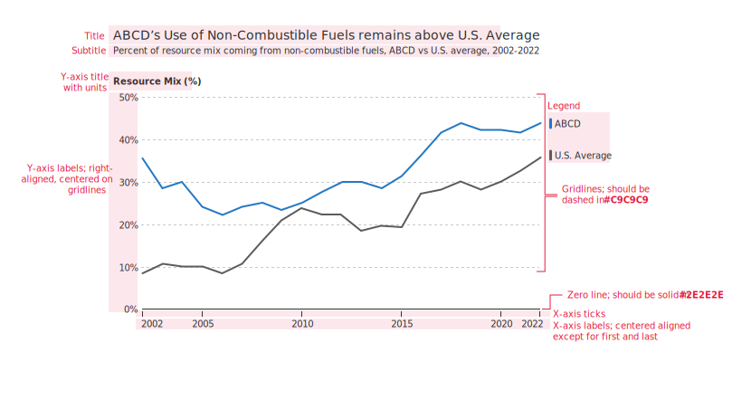
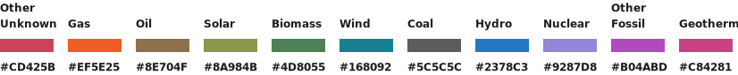
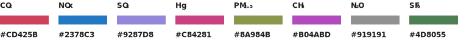

```{r, include = FALSE}
knitr::opts_chunk$set(
  fig.path=''
)
```

## Introduction

Welcome! This vignette will demonstrate how the EPA CAPD Data Visualization Style Guide can be integrated into your R visualizations. Through the use of the `{ggcapdthemes}` package and the `theme_capd` function, you can easily customize and standardize your ggplots!

```{r, echo = FALSE}

```

Because this package heavily depends on ggplot2, we suggest loading it prior to loading `ggcapdthemes`.

```{r setup}
library(ggplot2)
library(ggcapdthemes)
```

## ggplot2 default settings

Using this data, we can see the default theme elements used by ggplot2.

```{r, echo=3, fig.dim=c(6,4)}
line_data <- read.csv('../inst/line_chart_example_data.csv',sep = ',', header=TRUE)
line_data$year <- round(line_data$year)
ggplot(line_data) + geom_line(aes(x = year, y = value, color = group))
```

Over the course of this vignette, we will sequentially edit components of the theme to show the overall impact. Like other ggplot extension themes, `theme_capd` is build from one of the ggplot2 base themes, `theme_bw` and extends it.

```{r, echo=3:4, fig.dim=c(6,4)}
line_data <- read.csv('../inst/line_chart_example_data.csv',sep = ',', header=TRUE)
line_data$year <- round(line_data$year)
ggplot(line_data) + geom_line(aes(x = year, y = value, color = group)) + 
  theme_bw()
```

Here is a 10,000 foot view of `theme_capd` in its entirety. The following sections will delve into the specifics of each part of this theme.

```{r, echo = T, eval = F}
theme_capd <-function(){

  ## use default font until sysfonts kinks are worked out
  base_family <- NULL
  th <- list(
    ggplot2::theme_bw() %+replace%
      theme(
        ## format title, subtitle, caption
        plot.title= element_text(hjust = 0.5, family = base_family),
        plot.subtitle = element_text(hjust = 0.5, family = base_family),
        plot.caption = element_text(family = base_family),

        ## format plot background
        ## change background color
        plot.background = element_rect(fill = 'white', color = NA),
        panel.background = element_rect(fill = 'white', color = NA),
        panel.border = element_blank(),

        ## gridlines
        panel.grid = element_line(color = '#c9c9c9',linetype = 'dotted'),
        axis.line = element_line(color = '#2e2e2e', linetype = 'solid'),

        ## format axes
        axis.title = element_text(family = base_family),
        axis.title.y = element_text(vjust = 1, angle=0,hjust = 1),#,margin=margin(l=0,r=-100)),
        axis.ticks = element_blank(),
        axis.text = element_text(family = base_family),
        ## format legend
        legend.text = element_text(family = base_family),
        legend.title = element_text(),

      )
  )

  return(th)
}
```

<a href="#TOC">Return to Table of Contents</a>

## Titles, subtitles, captions, footnotes

Plot annotations such as titles, subtitles is formatted through the following theme options. These can modify position, font size, 

```{r, eval = FALSE}
plot.title = element_text(hjust = 0.5, family=base_family), 
plot.subtitle = element_text(hjust = 0.5, family = base_family)
plot.caption = element_text(family = base_family)
```

<a href="#TOC">Return to Table of Contents</a>


## Gridlines and background

```{r, eval = FALSE}
plot.background = element_rect(fill = "white", color = NA), 
panel.background = element_rect(fill = "white", color = NA), 
panel.border = element_blank(), 
panel.grid = element_line(color = "#c9c9c9", linetype = "dotted")

```

<a href="#TOC">Return to Table of Contents</a>

## Axes and ticks

`theme_capd` uses the following settings 

```{r, eval = FALSE}
axis.line = element_line(color = "#2e2e2e", linetype = "solid"), 
axis.title = element_text(), 
axis.title.y = element_text(vjust = 1, angle = 0, hjust = 1), 
axis.ticks = element_blank(), 
axis.text = element_text()
```


<a href="#TOC">Return to Table of Contents</a>

## Legends

```{r, eval = FALSE}
legend.text = element_text()
legend.title = element_text()
```

<a href="#TOC">Return to Table of Contents</a>

## Color

### Discrete color palettes

#### Fuel type

```{r, echo=1}
capd_palettes$fuel_type

```

#### Pollutant

```{r, echo=F}
capd_palettes$pollutant

```


## Font size, color

## Fontface (tentative)

## Font style
